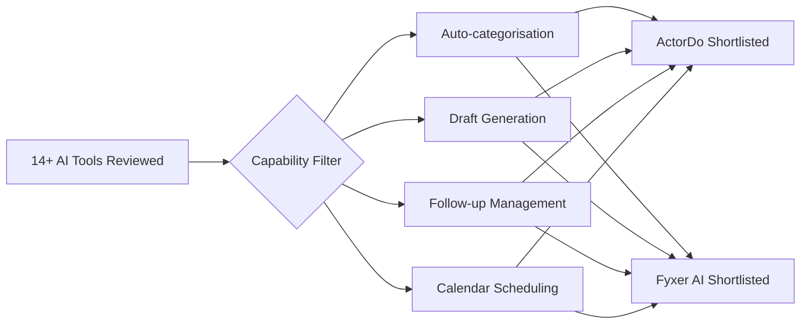
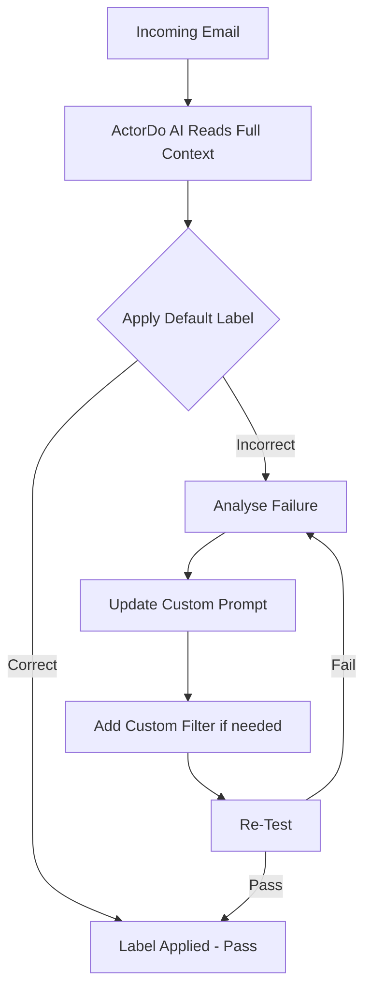
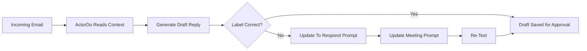
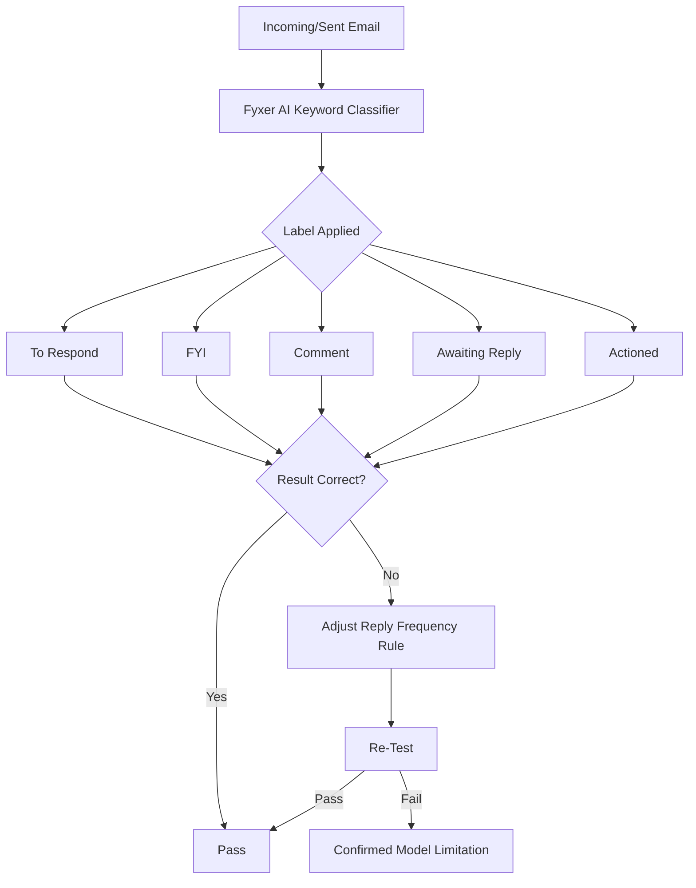

# Automate Executive Email Management with AI for Meydan Free Zone (Meydan FZ) — A Practical Evaluation of ActorDo and Fyxer AI for Outlook Categorisation, Drafting, and Follow-Up Automation

    

---

## What This Project Covers

This project was delivered as part of the **Practical AI for Executive Personal Assistant** initiative for **Meydan Free Zone (Meydan FZ)**, a leading business free zone authority based in Dubai, UAE. The core challenge was a real and pressing one for senior executives: the volume, complexity, and pace of Outlook-based email communication had grown to a point where manual management was no longer sustainable. The goal was to identify whether a ready-made AI tool could take over the burden of email categorisation, draft response creation, follow-up tracking, and meeting scheduling — without requiring custom software development.

The research began with a broad market scan of over 14 AI assistant tools. Each was evaluated against a defined capability framework covering four pillars: automatic email categorisation, AI-powered draft generation, reminder and follow-up management, and calendar scheduling intelligence. From this initial screening, two tools emerged as the most technically promising candidates for deeper hands-on evaluation — **ActorDo** and **Fyxer AI**. Both were connected to live Outlook inboxes and subjected to structured, scenario-based testing that simulated real executive email patterns.

The testing methodology was deliberately rigorous and iterative. Rather than relying on vendor claims or surface-level demos, each tool was tested against real email scenarios — NDAs requiring signatures, meeting confirmation threads, promotional emails, automated security notifications, and multi-turn conversational threads. Where a tool produced an incorrect classification or draft, the failure was documented, a targeted fix was designed (prompt update, custom filter, or configuration change), and the scenario was re-tested until it either passed or was confirmed as a fundamental model limitation.

ActorDo proved to be a genuinely configurable AI assistant. Its architecture supports custom prompt engineering per label, rule-based filters, AI training through example emails, and a unified chat-based interface that consolidates email, calendar, reminders, and briefings. Every classification error encountered during testing was resolved through systematic prompt iteration and custom filter logic — demonstrating that the tool's behaviour can be shaped precisely to an executive's workflow. Fyxer AI, by contrast, revealed itself to be a keyword-based classifier with a fixed internal model. Its "Comment" category — designed to distinguish conversational remarks from actionable emails — failed consistently across multiple test scenarios and configurations, a limitation confirmed to be architectural rather than configurable.

The final deliverable to Meydan Free Zone is an executive summary with a clear, evidence-backed recommendation, supported by the full testing documentation captured in this repository. The research demonstrates that AI-powered email management is not only feasible for executive workflows but is ready for deployment today — provided the right tool is selected and properly configured.

---

## Quick Highlights

- **Client**: Meydan Free Zone (Meydan FZ), Dubai, UAE
- **Tools evaluated in final testing**: ActorDo and Fyxer AI (shortlisted from 14+ tools)
- **Platform**: Microsoft Outlook (both tools integrate directly with Outlook inbox)
- **Email label categories tested**: 8 labels — Needs Action, To Respond, Read Later, Meeting, Awaiting Reply, Done, Promotion, Notification
- **ActorDo prompt iterations**: 2 custom prompt versions per label, plus custom filters for edge cases
- **Fyxer AI reply frequency rules tested**: 4 rule configurations (Rule 1 through Rule 4)
- **Total test scenarios documented**: 5 for ActorDo email labelling, 3 for ActorDo drafts, 4 for Fyxer AI categorisation
- **ActorDo draft style configured**: Balanced, 3–5 short paragraphs, Arial 14px, signed off as XXXXX
- **Follow-up automation**: 1-day follow-up draft trigger, with domain exclusion filters for noreply, newsletters, GitHub, Mailchimp, SendGrid
- **Fyxer AI known limitation**: "Comment" category is architecturally unstable — fails regardless of training examples or reply-frequency settings
- **Recommendation**: ActorDo selected as the production tool for executive email and calendar management
- **Final output**: Executive Summary PDF delivered to Meydan Free Zone

---

## Node-by-Node Implementation

### Phase 1 — Market Scan and Tool Shortlisting




---

#### Step 1 — Define Evaluation Framework

- **Capability pillar 1**: Automatic email categorisation by intent and context
- **Capability pillar 2**: AI-powered draft response generation with tone and style control
- **Capability pillar 3**: Reminder, follow-up scheduling, and tracking automation
- **Capability pillar 4**: Meeting scheduling with calendar integration and approval flows

Over fourteen tools were reviewed against these four pillars. The majority were eliminated due to lack of Outlook integration, absence of customisation, or purely rule-based (non-AI) architectures. ActorDo and Fyxer AI were the only two tools that demonstrated meaningful capability across all four areas and were advanced to hands-on testing.

---

#### Step 2 — ActorDo and Fyxer AI Selected for Deep Testing

- **ActorDo**: Custom prompts, rule-based filters, Email AI Training, Microsoft Calendar integration, daily briefing, unified chat interface
- **Fyxer AI**: Direct Outlook integration, default label set, basic draft generation, marketing filter slider, reply frequency settings

Both tools were connected to live Outlook accounts for all subsequent testing. No vendor sandboxes or demo environments were used — all results reflect real inbox behaviour.

---

### Phase 2 — ActorDo Email Labelling Configuration and Testing




---

#### Step 3 — Define 8 Email Label Categories

- **Node type**: ActorDo Email Management — Label Configuration
- **Labels configured**: Needs Action, To Respond, Read Later, Meeting, Awaiting Reply, Done, Promotion, Notification

Each label was given a default AI prompt defining the precise conditions under which it should be applied. The default prompts were sourced from ActorDo's built-in system and then refined iteratively through custom prompt versions as testing revealed edge cases.

---

#### Step 4 — Test Scenario 1: NDA Upload Thread (Needs Action → Awaiting Reply → Done)

- **Email thread**: Three-email sequence — inbound request to upload a signed NDA, outbound confirmation of upload, inbound closure reply from sender
- **Test result (pass)**: "Needs Action" correctly applied to the inbound task request
- **Test result (pass)**: "Awaiting Reply" correctly applied to the sent confirmation email
- **Test result (fail)**: Third email ("Got the NDA — everything looks good") was labelled "Read Later" instead of "Done"

The failure occurred because the default "Read Later" prompt did not distinguish between genuinely informational emails and closure replies arriving on threads previously marked "Awaiting Reply." The default "Done" label also had no prompt, meaning ActorDo had no instruction for when to apply it.

**Fix applied — Custom Prompt update for three labels:**

- **Awaiting Reply custom prompt**: Added logic that if a reply says "got it", "received", "thanks", "done", or "confirmed", the label should transition to "Done"; if it asks new information, transition to "To Respond"
- **Read Later custom prompt**: Added explicit exclusion — do not apply this label to direct replies on threads currently marked "Awaiting Reply"
- **Done custom prompt**: Added definition — apply when a conversation is fully complete and no reply or action is expected; only after a true confirmation or closure reply is received

**Re-test result**: PASSED — "Done" correctly applied to the closure reply.

---

#### Step 5 — Test Scenario 2: Meeting Confirmation Thread (To Respond → Awaiting Reply)

- **Email thread**: Two-email sequence — inbound meeting time confirmation request, outbound reply confirming time and requesting the invite be sent
- **Test result (pass)**: "To Respond" correctly applied to the inbound confirmation request
- **Test result (fail)**: Outbound reply ("3 PM works — please send the meeting invite") was labelled "Done" instead of "Awaiting Reply"

The outbound reply confirmed the time but explicitly asked the other party to send an invite — meaning the thread was still open and waiting. ActorDo's default logic treated the confirmation as a closed action.

**Fix attempt 1 — Custom Prompt update for Awaiting Reply and Done**: Updated prompts to specify that if the last message asks the other person to act, send something, or provide information, the thread should remain "Awaiting Reply." Result: FAILED — the prompt change alone was insufficient.

**Fix attempt 2 — Custom Filter (Outgoing email type)**:

```
Email Type: Outgoing
Prompt: If I send an email that confirms something but also asks the other
person to act, reply, or send information (for example to send an invite,
share a link, approve, or provide a document), treat it as Awaiting Reply
instead of Done.
When YES: Apply Label — Awaiting Reply
When NO: Continue to next rule
```

**Re-test result**: PASSED — "Awaiting Reply" correctly applied.

---

#### Step 6 — Test Scenario 3: Informational Report (Read Later)

- **Email**: Monthly performance report shared for reference, explicitly noted as requiring no action
- **Test result**: "Read Later" correctly applied on first attempt — PASSED with no fix required

This scenario confirmed that ActorDo's contextual reading of email intent (not just keywords) correctly identified a passive informational email and distinguished it from actionable content.

---

#### Step 7 — Test Scenario 4: Promotional Email Mislabelled as Needs Action

- **Email**: Upgrade promotion from Codebasics offering 30% off, with a call-to-action button
- **Test result (fail)**: "Needs Action" applied instead of "Promotion"

The default "Needs Action" prompt was too broad — the phrase "upgrade now" in the email body was interpreted as a task directed at the recipient.

**Fix attempt — Custom Prompt update for Promotion label**: Added explicit instruction that if an email encourages purchase or upgrade with offers or discounts, it should be labelled Promotion even if it uses action verbs like "buy", "upgrade", or "get started."

**Fix attempt 2 — Custom Filter (Incoming email type)**:

```
Email Type: Incoming
Prompt: If an incoming email contains words like offer, discount, upgrade plan,
or newsletter and comes from Codebasics or any company domain, apply the label
Promotion instead of Needs Action.
When YES: Apply Label — Promotion
When NO: Continue to next rule
```

**Re-test result**: PASSED — "Promotion" correctly applied.

---

#### Step 8 — Test Scenario 5: Automated Security Notification Mislabelled as Needs Action

- **Email**: Automated password change notification from Codebasics Account Security System with "do not reply" footer
- **Test result (fail)**: "Needs Action" applied instead of "Notification"

The default "Notification" prompt was not specific enough to override "Needs Action" when security-related language (reset, verify) appeared in the email body.

**Fix attempt — Custom Prompt update for Notification label**: Added instruction that routine security or account alerts sent automatically (password change, login notice, system alert) that do not personally ask for a reply should be labelled "Notification", not "Needs Action."

**Fix attempt 2 — Custom Filter (Incoming email type)**:

```
Email Type: Incoming
Prompt: If the incoming email says "automated message", "system update", or
"do not reply" and does not contain words like "reset", "verify", or
"confirm password", then apply the label Notification.
When YES: Apply Label — Notification
When NO: Continue to next rule
```

**Re-test result**: PASSED — "Notification" correctly applied.

---

### Phase 3 — ActorDo Draft Generation Configuration and Testing




---

#### Step 9 — Draft Generation Configuration

- **Auto-create draft responses**: ON
- **Draft proactiveness level**: Standard
- **Draft style**: Balanced
- **Tone of voice instruction**: Create a balanced professional reply draft (3–5 short paragraphs). Preserve key details (dates, times, links) from the original message, clearly state the next steps or confirmations required, and include one-line suggested actions when appropriate. Keep language polite and direct. Sign off as "XXXXX".
- **Include original content**: ON
- **Font family / size**: Arial / 14px
- **Auto-delete old drafts**: Never delete

---

#### Step 10 — Draft Test 1: NDA Upload Request

- **Email**: Request to download, sign, and upload a vendor agreement by Friday 6 PM
- **Test result**: Draft created correctly, label "Needs Action" applied — PASSED

Draft generated:

> "Hi Riya, I'll download and sign the vendor agreement and upload it to the OneDrive folder by Friday at 6 PM. I'll confirm once it's done. Thanks for your help! — XXXXX"

---

#### Step 11 — Draft Test 2: Meeting Time Confirmation (Wrong Label on Draft)

- **Email**: Request to confirm if 3 PM tomorrow works for a catch-up meeting
- **Test result (fail)**: Draft created correctly, but label applied was "Needs Action" instead of "To Respond"

**Fix applied — Custom Prompt update for To Respond label**: Added instruction to use "To Respond" for short confirmations like "Does 3 PM work?" rather than "Needs Action." Excluded automated or optional messages.

**Re-test result**: PASSED — "To Respond" correctly applied.

---

#### Step 12 — Draft Test 3: Meeting Agenda Confirmation (Wrong Label on Draft)

- **Email**: Meeting scheduled for Thursday 2 PM with agenda items listed; asked to confirm or suggest alternative
- **Test result (fail)**: Draft created correctly, but label applied was "To Respond" instead of "Meeting"

The overlap between "To Respond" (short confirmation needed) and "Meeting" (scheduling, agenda, time) caused the misclassification. The presence of an agenda and a time should have triggered "Meeting."

**Fix applied — Custom Prompt updates for both Meeting and To Respond labels:**

- **Meeting custom prompt 2**: If the message asks the recipient to confirm or accept a meeting time or availability, treat the thread as Meeting (not To Respond) so all scheduling threads stay grouped together
- **To Respond custom prompt 2**: Use "To Respond" for conversational confirmations not tied to scheduling or calendar items. If the message is about confirming availability for a meeting, mentions an agenda, time, or link — prefer "Meeting" instead

**Re-test result**: PASSED — "Meeting" correctly applied.

---

#### Step 13 — Follow-Up Draft Automation Configuration

- **Auto-create follow-up drafts**: ON
- **Normal follow-up (days)**: 1
- **Follow-up domain exclusion filters**: noreply@, no-reply@, newsletter, @newsletter., @newsletters., @mailchimp.com, @sendgrid.net, @service-now.com, @github.com
- **Follow-up draft AI prompt**:

```
Create a concise, polite follow-up draft (2–3 short lines) referencing the
original message and requesting a reply. Mention the original topic and a
simple next step (e.g., confirm, send invite, upload file). Keep tone friendly
and professional. Sign off as "XXXXX". Do NOT send automatically — save as
draft for approval.
```

**Test result**: PASSED — follow-up drafts created correctly and saved for approval.

---

#### Step 14 — Reminder Configuration (ActorDo)

- **Feature**: ActorDo Reminder system — functions as a personal alert system within the AI assistant
- **Configured reminder**:

| Field | Value |
|---|---|
| Title | Follow up meeting summary email |
| Next Date | 13-11-2025 |
| Time | 10:00 AM |
| Frequency | Weekly |
| Weekdays | Thursday |
| Notification Channel | Email, WhatsApp, Chat |

This reminder was configured as a live production deployment for the client's executive workflow. The Reminder system in ActorDo currently operates independently of calendar events but is designed to connect to calendar-based triggers in future versions.

---

### Phase 4 — Fyxer AI Testing and Evaluation




---

#### Step 15 — Fyxer AI Default Label Configuration

- **Node type**: Fyxer AI — Email Assistant → Categorisation → Settings
- **Default labels**: To Respond, FYI, Comment, Notifications, Meeting Update, Awaiting Reply, Actioned, Marketing
- **Respect user-applied labels**: ON
- **Conversation view**: Enabled (threads grouped as in Gmail/Outlook)

Fyxer AI provides eight default categories with fixed internal descriptions. Unlike ActorDo, there is no mechanism to modify the AI prompt behind each label, add custom categories, or train the model on example emails. Configuration is limited to email address rules, marketing filter slider settings, and reply frequency rules.

---

#### Step 16 — Fyxer Test 1: Sent Item Awaiting Reply (Reply Frequency Failure)

- **Scenario**: Inbound email requesting revised project timeline; outbound reply asking sender to send the revised timeline back
- **Inbound test result (pass)**: "To Respond" correctly applied
- **Outbound test result (fail)**: "Actioned" applied instead of "Awaiting Reply"

The outbound message ("please send me the revised timeline") clearly required a response from the other party, but Fyxer classified it as completed.

**Fix attempt — Reply frequency setting updated from Rule 1 to Rule 2**:

| Rule | Description |
|---|---|
| Rule 1 (default) | I reply to almost everything, even just to be polite |
| Rule 2 | I reply when there's something new or useful to say |

**Re-test result**: PASSED — "Awaiting Reply" correctly applied after switching to Rule 2.

---

#### Step 17 — Fyxer Test 2: Complex Sent Item (Persistent Actioned Failure)

- **Scenario**: Sent email offering to review metrics and asking sender to confirm if revised version works before leadership submission
- **Test result (fail)**: "Actioned" applied across all rule configurations (Rule 2, Rule 3, Rule 4)

Root cause analysis documented:

| Factor | Explanation |
|---|---|
| Why Test 1 worked | Sender asked question → user replied → sender must reply back. Directional workflow clear. |
| Why Test 2 failed | "I'll review and share my inputs shortly" — Fyxer weighted this as task completion, overriding "please confirm" |
| Model behaviour | Fyxer decides: reply sounds like sender must act → Awaiting Reply. Reply sounds like user delivered something → Actioned. |
| Key insight | Start with the expectation that THEY must act, not with what YOU will do first. |

**Fix applied — Fyxer Intention (Model Behaviour)**: Rewrote the reply body to place the expectation of the other party's action in the opening sentence before any statement of the user's own actions.

**Re-test 3 result**: PASSED — "Awaiting Reply" correctly applied when reply opened with "Before I finalise the metrics section, please confirm that the current version you shared is the latest one."

---

#### Step 18 — Fyxer Test 3: FYI Classification

- **Scenario**: Email sharing updated Q1 team structure for awareness only
- **Test result**: "FYI" correctly applied — PASSED on first attempt

---

#### Step 19 — Fyxer Test 4: Comment Category — Confirmed Model Limitation

- **Scenario**: Email sharing subjective observations about a dashboard walkthrough — no action requested, no reply expected
- **Test result (fail)**: "FYI" applied instead of "Comment" — and all subsequent re-tests with stronger comment signals also failed

Multiple re-test attempts were made with increasingly strong "comment" signals — opinions, observations, subjective language, no questions, no action words. Fyxer consistently returned "To Respond" or "FYI" rather than "Comment."

**Confirmed root cause**:

> Fyxer's "Comment" category is not a stable, independent intent class in the model's internal classification logic. Commentary emails in the real world frequently transition into replies or actions, so the model has learned to associate subjective feedback with "response needed." This is a fundamental model limitation, not a configuration gap. No email rule, reply frequency setting, or training example can resolve it.

This finding directly informed the final recommendation against Fyxer AI for enterprise deployment.

---

## Key Concepts Learned

**Contextual AI classification is fundamentally different from keyword matching, and the difference becomes critical at enterprise scale.** ActorDo reads the full semantic intent of an email — who sent it, what they asked, what the thread history implies — while Fyxer AI extracts surface keywords and maps them to categories. In controlled testing, this distinction was the deciding factor in nearly every misclassification. An email containing the words "upgrade now" is a promotion, not a task — but only an AI reading context can reliably know that.

**Iterative prompt engineering is the core skill for deploying AI email management tools in production.** Default prompts are starting points, not production configurations. Every one of ActorDo's label failures was resolved through a targeted, specific prompt update — not a wholesale reconfiguration. The ability to isolate which label's logic was failing, write a precise override, and re-test against the original scenario is what separates a working deployment from a broken one. Teams deploying these tools should expect and budget for this iteration phase.

**Custom filters serve as a safety net when prompt logic alone cannot capture edge cases.** Several scenarios — particularly the outgoing "awaiting reply" classification and the promotional email override — required custom filters rather than prompt updates. Filters operate at a different layer than prompts: they apply deterministic rules before or after AI classification, catching specific patterns that the language model would otherwise mishandle. Having both mechanisms available (as ActorDo does) is a significant architectural advantage over tools that offer only one.

**A tool's inability to be trained or customised is not a minor limitation — it is a disqualifying one for executive workflows.** Fyxer AI's fixed internal model means that every misclassification is permanent. There is no mechanism to teach it, correct it, or shape its behaviour to a specific executive's communication style. Over time, the gap between what the tool does and what the executive needs will widen, not narrow. For senior executives whose inboxes carry high-stakes, nuanced communication, this is an unacceptable risk.

**Model limitations must be distinguished from configuration gaps before drawing conclusions.** The Fyxer AI "Comment" category failure was initially investigated as a configuration problem — and multiple fix attempts were made before it was confirmed as a model limitation. This distinction matters because configuration problems can be solved, while model limitations require a different tool. Documenting the diagnosis process, not just the outcome, is essential for any evaluation delivered to a client.

**The architecture of follow-up automation reveals how much a tool truly understands email lifecycle.** A tool that can generate a draft reply is doing something simple. A tool that tracks whether a sent email is waiting for a response, surfaces it after one day, generates a polite follow-up draft, and excludes automated senders and newsletters from this loop — that is a tool that understands the full lifecycle of a business conversation. ActorDo's follow-up automation, configured with domain exclusions and draft-only (not auto-send) behaviour, reflects this deeper architectural maturity.

---

## Templates and Resources

- **Download Executive Summary PDF**: [executive-summary-ai-personal-assistant-meydan-fz.pdf](https://github.com/CB-Work-Automations/Meydan-FZ-Personal-Assistant/blob/main/Executive%20summary%20AI%20Personal%20Assistant%20Tools.docx.pdf)

---

## Author

**Sachin Savkare**
Business Automation Engineer | Codebasics
